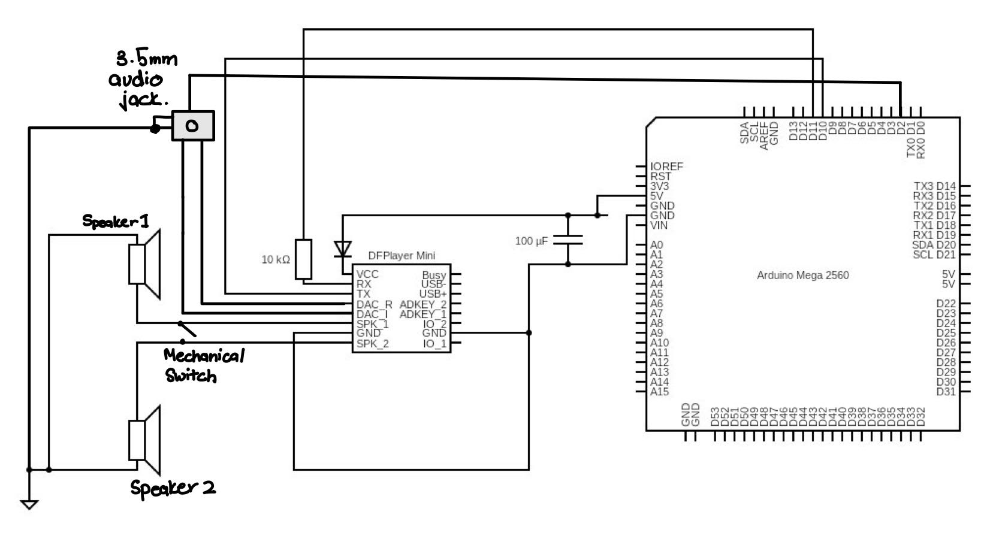
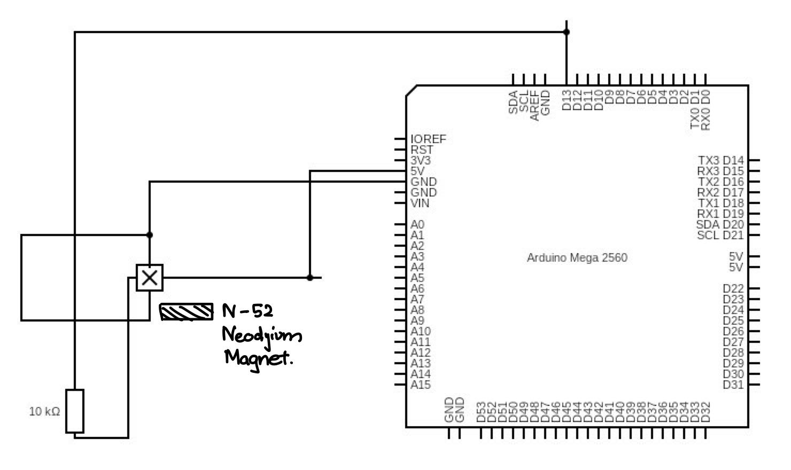

# Pinball Table Subsystems: Audio & Hall Effect Sensing

This repo contains the implementation of the **Audio System** and **Non-Contact Hall Effect Sensors** for a university pinball table prototype.  
It includes Arduino code, circuit diagrams, and a detailed design report describing hardware selection, system integration, and testing.

---

## ✨ Features

- 🎵 **Audio System**:
  - DFPlayer Mini MP3 playback module (with microSD support).  
  - Two 4Ω, 3W speakers (AS04004PO-2-LW152-R).  
  - 3.5 mm audio jack with debug mode (headphone output).  
  - Mechanical switch for speaker/headphone routing.  
  - UART control from Arduino Mega.  
  - Built-in equalizer settings for customized audio clarity.

- 🧲 **Hall Effect Sensing System**:
  - A3214 Hall Effect Sensors with N52 Neodymium magnets.  
  - Micropower, polarity-independent detection of pinball motion.  
  - Latched digital output for stable event detection.  
  - Typical operate point: ±48 Gauss, response time: 60 μs.  
  - Arduino integration with 10kΩ pull-down resistors.

- ⚡ **Robust Hardware Design**:
  - Capacitors to smooth voltage fluctuations.  
  - Common ground and filtering to reduce noise.  
  - Stripboard soldered circuits for modularity.

- ✅ **Testing Results**:
  - Audio: 200 Hz – 20 kHz frequency response, <10 ms latency, stable 3W output.  
  - Hall sensors: >80% detection accuracy, <5 ms response time, <10% error after calibration.

---

## 📦 Repo Structure

```
.
├─ Audio_Final.ino         # Arduino sketch for audio system
├─ Audio_Final.jpg         # Circuit diagram of audio architecture
├─ HallEffect.ino          # Arduino sketch for Hall Effect sensing
├─ halleffect_final.jpg    # Circuit diagram of Hall Effect system
└─ D4 - Individual Report.pdf  # Full subsystem design report
```
References Arduino code, circuits, and report.

---

## 🚀 Quickstart

> Requires Arduino IDE and Arduino Mega 2560 (or compatible board).

1. **Audio System**  
   - Upload `Audio_Final.ino` to the Arduino.  
   - Insert microSD card into DFPlayer Mini with properly indexed MP3 files.  
   - Connect speakers or headphones.  
   - Trigger sounds from game events via UART.  

2. **Hall Effect System**  
   - Upload `HallEffect.ino`.  
   - Mount A3214 sensors under playfield, pair with N52 magnets.  
   - Use pull-down resistors to stabilize inputs.  
   - Ball movement will toggle sensor output for scoring/triggering events.  

---

## 📒 Example Circuit Diagrams

- **Audio Circuit (DFPlayer + Arduino + Speakers + Headphone Jack)**  
  

- **Hall Effect Circuit (A3214 Sensor + Magnet + Arduino)**  
  

---

## 🧪 Testing Summary

- **Audio System**:  
  - Clear playback with minimal distortion at 3W output.  
  - Debug mode (headphone-only) verified.  
  - Latency: ~10 ms response to triggers.  

- **Hall Effect Sensors**:  
  - Accurate detection at different ball speeds.  
  - <5 ms response time validated on oscilloscope.  
  - Error rate <10% after calibration.  
  - Stress-tested under repeated impacts with heavy pinball.

---

## 🗺️ Roadmap

Future extensions include:  
- 🎶 Stereo sound expansion.  
- 🎛️ More advanced sound effects (e.g., dynamic reverb).  
- 🧩 Additional sensors (optical or inductive) for more gameplay elements.  
- 🏓 Integration with other pinball subsystems (scoring, flippers, bumpers).
